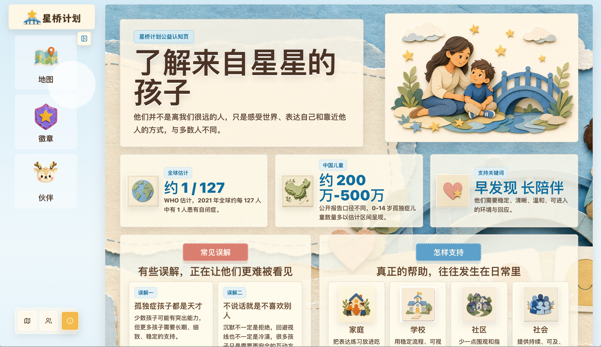
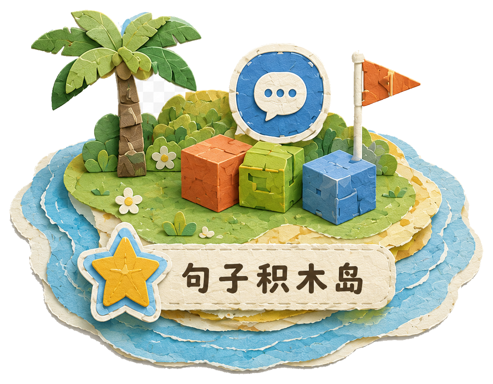
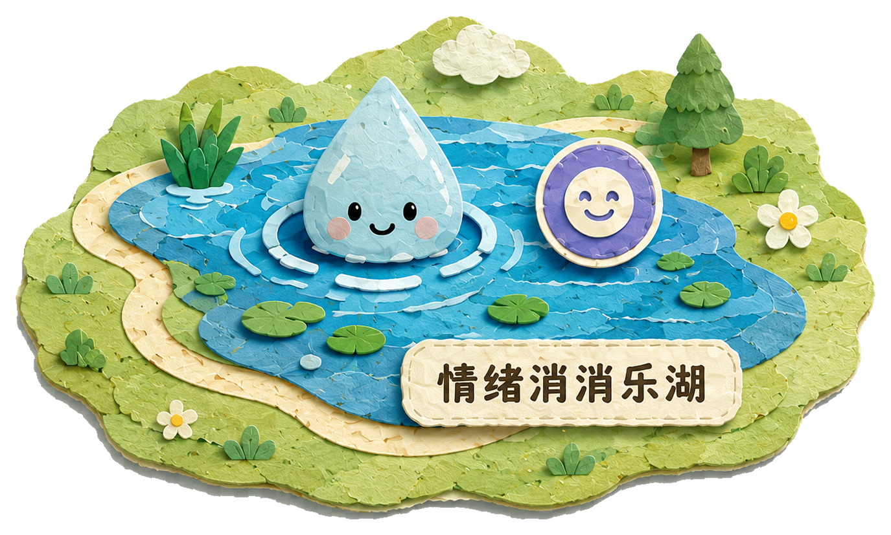
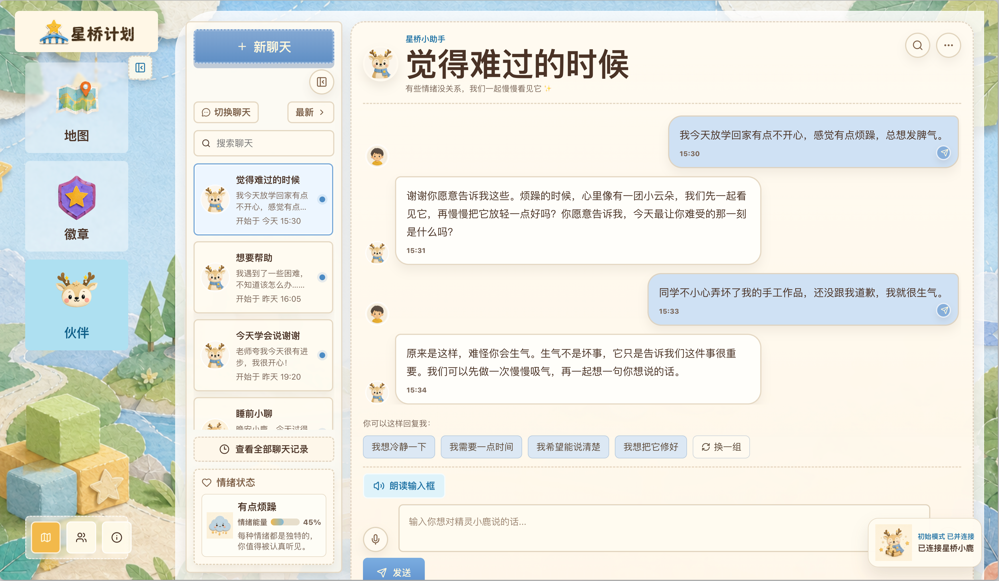

# 🌉 StarBridge · 星桥计划

**面向孤独症儿童的表达成长游戏 —— 让一句「我想要水」不再难以说出口**


[快速开始](#-快速开始) · [产品理念](#-为什么做这个) · [完整闭环](#-完整闭环) · [三大岛屿](#-三大岛屿) · [感官友好设计](#-感官友好设计)

---

## 💫 为什么做这个

人们常把孤独症儿童称为**「来自星星的孩子」**。这个名字很美,但在美好的称呼之外,他们和他们的家庭面对的,往往是漫长、具体而日常的现实。

对一些孩子来说,普通人轻易说出口的一句话 —— "我要喝水"、"我不喜欢"、"请帮帮我"、"我可以一起玩吗" —— 可能需要很长时间学习。这些话看起来简单,却关系到一个孩子能不能表达需求、能不能减少崩溃、能不能进入一段关系。

> **星桥计划**想做的事很小:用游戏让孩子先在安全的环境里练表达,再让家长把同样的练习带回真实生活。我们不替代任何治疗师、不替代任何陪伴,我们只是想做那座桥。



---

## 🔁 完整闭环

星桥不是另一个儿童益智游戏。它是一条把游戏成长**真正迁移到现实生活**的链路:

```text
   ┌────────────────────┐         ┌────────────────────┐
   │   👶 儿童端游戏    │  ───→   │   ⭐ 通关奖励       │
   │  句子 / 情绪 / 礼貌 │         │  星星 · 图鉴 · 徽章 │
   └────────────────────┘         └─────────┬──────────┘
              ▲                              │
              │                              ▼
   ┌──────────┴─────────┐         ┌────────────────────┐
   │   🦌 伙伴回流成长  │ ◀───    │   🏆 成就页展示    │
   │  星光小鹿额外经验  │         │   今日成长可视化    │
   └────────────────────┘         └─────────┬──────────┘
              ▲                              │
              │                              ▼
   ┌──────────┴─────────┐         ┌────────────────────┐
   │   ✅ 家长打卡反馈   │ ◀───    │   👨‍👩‍👧 家长端建议   │
   │   "已练习"        │         │ AI 生成现实陪练方案 │
   └────────────────────┘         └────────────────────┘
```

**孩子在游戏中学会表达 → 游戏记录成长 → 家长知道今天该怎么练 → 现实练习回流游戏。** 这条链路,就是星桥的全部。

---

## 🏝 三大岛屿

每个岛屿对应一种核心表达能力,分基础 / 中等 / 进阶三档难度。

### 🧱 句子积木岛



**练习完整表达需求** —— 用「人物 + 表达 + 物品」三色积木,拼出「我想要水」、「妈妈要饼干」。
技能徽章:**表达星 ⭐**

### 💎 情绪消消乐湖



**识别、匹配、理解情绪** —— 把相同情绪的动物卡配成对,从开心、难过到生气、平静。
技能徽章:**情绪宝石 💎**

### 👋 问候 / 礼貌语岛


**练习社交礼貌表达** —— 看场景配出最合适的话,「早上好」「对不起,我不是故意的」。
技能徽章:**友好徽章 🎖**

---

## 📸 截图速览

### 儿童端 · 游戏世界

岛屿地图,星光小鹿陪着孩子选择今天的练习:


难过时,可以找小鹿说说话:



### 三个小游戏

句子积木 —— 三色分类、可朗读、可换一组:


情绪宝石消消乐 —— 翻牌配对,温和版:


友好话语连连看 —— 看场景图,从右侧选出最合适的一句话:


### 家长端 · AI 陪练建议

根据孩子今天在游戏中学到的技能,生成一段可在生活中直接照做的陪练方案:


---

## 🌿 感官友好设计

星桥所有页面和小游戏,都遵守一份「不做什么」清单。这不是产品功能,这是产品底线:

| 🚫 我们不做 | ✅ 我们坚持做 |
|---|---|
| 不倒计时、不催促 | 节奏由孩子掌控 |
| 不红叉、不扣分 | 答错只说「我们再试一次」 |
| 不突然闪烁、不刺耳音效 | 动效缓慢、声音柔和 |
| 不失败惩罚 | 所有任务都可跳过、可重复 |
| 不让 AI 判定孩子答案对错 | 关键反馈必须稳定、可预测 |
| 不密集元素、不高饱和 | 大按钮、大卡片、大间距、低饱和暖色 |

**所有关键文字都支持 🔊 朗读** —— 全局 `SpeakButton` 组件,基于浏览器 `speechSynthesis`,中文女声、语速 0.85x。

---

## 🛠 技术栈

| 层 | 选型 | 备注 |
|---|---|---|
| 框架 | **React 19** + **TypeScript** + **Vite 8** | 极快冷启动,适合 demo 迭代 |
| 路由 | **React Router 7** | 7 个路由,儿童端 / 家长端 / 科普页 |
| 状态 | **React Context** + **localStorage** | 无后端,demo 进度本地持久化 |
| 图标 | **lucide-react** | 线性图标,与纸艺风搭配 |
| 样式 | **原生 CSS + CSS Variables** | 主题色锁在 `:root`,不引入 CSS-in-JS |
| 语音 | **Web Speech API** | 全局朗读组件 |

**无后端、无登录、无数据库** —— 当前阶段所有数据都在浏览器里,刷新即生效,demo 一键可跑。

---

## 🚀 快速开始

```bash
# 1. 安装依赖
npm install

# 2. 启动开发服务器
npm run dev

# 3. 打开浏览器
# → http://localhost:5173
```

构建与预览:

```bash
npm run build      # tsc -b && vite build
npm run preview    # 本地预览生产构建
npm run lint       # ESLint 检查
```

---

## 🗺 路由地图

| 路径 | 页面 | 角色 |
|---|---|---|
| `/` 或 `/game` | 岛屿地图主页 | 儿童端 |
| `/level/:levelId` | 单个关卡(三种小游戏之一) | 儿童端 |
| `/achievements` | 成就页(徽章墙 / 图鉴 / 伙伴成长) | 儿童端 |
| `/buddy-chat` | 星光小鹿聊天页 | 儿童端 |
| `/parent` | AI 陪练建议 | 家长端 |
| `/about-autism` | 孤独症科普长文 | 公众 |

可直接试的关卡 ID:`sentence-basic-01` · `emotion-basic-01` · `greeting-basic-01`

---

## 📂 项目结构

```text
src/
├── app/                       # 应用入口 · 路由 · 全局 Provider
├── pages/                     # 顶层页面(对应路由)
│   ├── GameHomePage.tsx       # 岛屿地图
│   ├── LevelPage.tsx          # 关卡壳(按 mechanic 加载游戏)
│   ├── AchievementsPage.tsx
│   ├── ParentPage.tsx
│   └── AboutAutismPage.tsx
├── features/                  # 业务模块
│   ├── levels/                # 三个小游戏组件
│   │   ├── SentenceBlocksGame.tsx
│   │   ├── EmotionMatchGame.tsx
│   │   └── FriendlySpeechMatchGame.tsx
│   ├── game-map/              # 地图框架
│   ├── achievements/          # 徽章墙 / 图鉴 / 伙伴成长
│   ├── parent/                # 家长端模块
│   └── buddy-chat/            # 伙伴聊天页
├── shared/
│   ├── components/            # Button / Card / SpeakButton / PageShell …
│   ├── data/                  # 岛屿 / 关卡 / 卡片 / 徽章 mock
│   ├── store/                 # GameProvider + useGameStore
│   ├── utils/                 # rewards / practice / speech …
│   └── types/                 # 统一类型定义
├── assets/                    # 全部纸艺风插画素材
└── styles/                    # 全局 CSS + 主题变量
```

---

## 📦 当前边界

诚实声明:这是黑客松阶段的 demo,**主动选择不做**以下事情:

- ❌ 不含登录注册、后端服务、真实数据库 —— 所有进度在 localStorage
- ❌ 不接入真实语音识别 / 真实图像识别
- ❌ 三个岛屿目前每个只开放 1 关基础难度,中等 / 进阶为 mock 展示
- ❌ 地图上「求助山谷」「排队城堡」为占位,后续迭代

**已落地范围**:完整闭环跑通 · 三个小游戏可玩 · 家长端建议可读 · 关键文字可朗读 · 纸艺风视觉统一。

---

## 🎨 设计语言

视觉锁定在一组 CSS 变量里,任何新组件都从这里取色:

```css
:root {
  --color-bg: #d7ecf7;          /* 柔和蓝天 */
  --color-paper: #fff6e6;        /* 米白纸 */
  --color-paper-deep: #f1dfc1;   /* 深米色 */
  --color-primary: #f2b84b;      /* 暖橙 */
  --color-blue: #79bde0;         /* 海洋蓝 */
  --color-green: #96c38a;        /* 草地绿 */
  --color-text: #4a3326;         /* 深棕字 */
  --radius-card: 24px;
  --shadow-soft: 0 10px 24px rgba(80, 60, 40, 0.14);
}
```

风格关键词:**手工纸艺**、**拼贴感**、**缝线卡片**、**星光小鹿**、**桥、岛、云、叶**。

---

## 🌟 致谢

这个项目献给每一个慢慢学着说话的孩子,以及每一位在他们身后耐心等待的家人。

> 真正的支持,常常不是宏大的口号,而是很具体的日常。

如果你也想为「来自星星的孩子」做点什么 —— 提 issue、改代码、补题库、设计新关卡 —— 都欢迎加入。

---

<sub>Made with 🧡 for the children from the stars.</sub>
